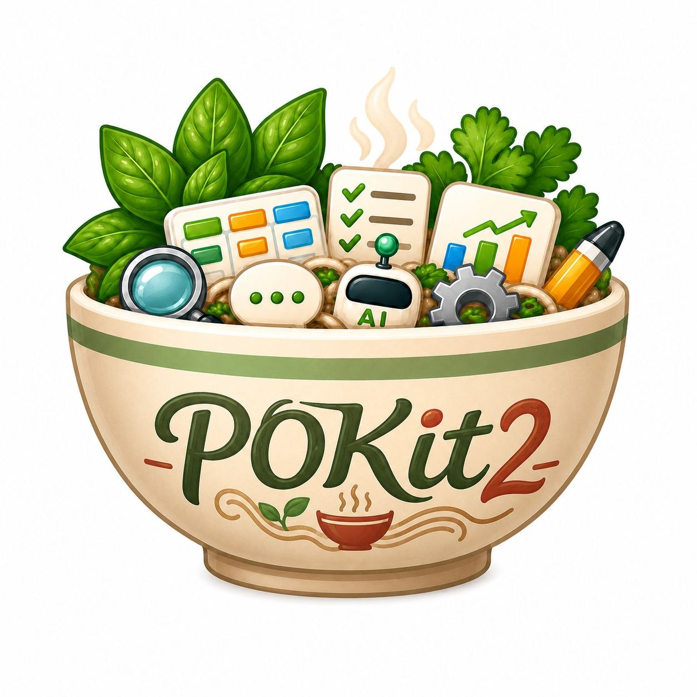

<p align="center">
  
</p>

# POKit2

POKit2 is a local-first AI work harness for PO-led product work and PO-led AI product work.

It turns rough requests into issue-driven work, keeps state in your repository, and blocks "done" claims until there is fresh evidence.

```text
request
  -> backlog refinement
  -> Harness Issue
  -> scoped execution
  -> verification evidence
  -> gate decision
  -> memory / handoff
  -> next issue
```

POKit2 is published as the `pokit2` npm package ([npmjs.com/package/pokit2](https://www.npmjs.com/package/pokit2)). Install it with a single `npx` command. The package provides the `pokit` CLI and keeps the harness scripts, standards, and tests in one global location; your project keeps only a thin residue of state and agent-surface files.

## Quick Install

### Recommended: npx one-liner

```bash
mkdir my-project && cd my-project
npx pokit2 install
```

`npx pokit2 install` installs the thin project residue into the current directory. Pass `--yes` to skip the confirmation prompt, or `--root <dir>` to target a different directory. Running `pokit install` without `--yes` prints a preview and writes nothing; `npx pokit2` with no arguments prints the command list.

After install, run the doctor to confirm the setup:

```bash
pokit doctor
```

Then open the project in Claude Code and start with:

```text
포킷 시작
```

### Global install

```bash
npm i -g pokit2
pokit install
```

### Options

| Flag | Effect |
|---|---|
| (none) | Preview mode: shows what would be installed, writes nothing. |
| `install` | Install the thin project residue into the current directory. |
| `install --yes` | Skip confirmation prompt. |
| `install --root <dir>` | Target a specific directory instead of `cwd`. |

### Legacy v0.18 full-copy migration

If your project was set up with a full-copy starter (v0.18 or earlier), running `pokit install` automatically detects the legacy layout and migrates it: legacy harness body files are removed, and your user state (`.ai-os`) is preserved in place. No manual file surgery required.

## Runtime Setup

After install, your project contains the runtime entrypoint `AGENTS.md` (with a tool-owned marker block) and the POKit skill surfaces under `.claude/skills`.

`.claude/skills` is Claude Code's repo-local skill surface. It is present because Claude Code can discover it directly from the project. Other runtime entrypoint files (such as `CLAUDE.md` or `ANTIGRAVITY.md`) are not created by `pokit install`; add them yourself if your runtime needs a bridge file pointing at `AGENTS.md`.

For Codex, install the skills into your Codex skill directory. The source path is your installed project's `.claude/skills`:

```bash
mkdir -p ~/.codex/skills
cp -R .claude/skills/pokit-* ~/.codex/skills/
```

If you use a custom `CODEX_HOME`:

```bash
mkdir -p "$CODEX_HOME/skills"
cp -R .claude/skills/pokit-* "$CODEX_HOME/skills/"
```

Then restart Codex or open a fresh session from the project root.

For Claude Code, keep `.claude/skills` in the repository and open Claude Code from the project root.

For Antigravity, create an `ANTIGRAVITY.md` bridge pointing at `AGENTS.md`. Do not assume native POKit skill discovery there until you have runtime-specific proof.

Runtime support should be claimed only after real discovery, trigger, and execution proof. Skill files are setup surfaces; gate completion still requires fresh verification evidence.

## First Run

Start with natural language:

```text
포킷 시작
```

The runner restores:

- active project
- active issue
- gate state
- next action
- startup context budget

POKit2 is an issue-driven local AI harness: durable work starts from a Harness Issue, moves through verification, and only then reaches a gate decision.

New to POKit? Start with the beginner onboarding docs:

- [POKit 개념 한눈에 보기](docs/onboarding/pokit-concepts-for-users.md)
- [POKit 흐름 한 장](docs/onboarding/pokit-flow-overview.md)

The starter begins with the default `common` project and `COM` namespace. Create your first issue without choosing an ID:

```bash
pokit issue:create --title "첫 작업"
pokit issues
pokit doctor
```

Selecting and advancing the active issue is owned by the agent workflow: open the project in your agent runtime, start with `포킷 시작`, and let the POKit skills manage `.ai-os/current.md`.

To use your own project and issue counter:

```bash
pokit project:init --key my-project --name "My Project" --prefix MYP
pokit project:use --project my-project
pokit issue:create --title "첫 작업"
pokit doctor
```

Manual `--id` remains available as an explicit override, but the beginner flow should let the active project choose the next issue number.

From there, the normal work loop is:

```text
포킷 시작
  -> create or select an issue
  -> ask the agent to refine or execute
  -> verify with doctor/tests/smoke
  -> pass the gate only after evidence exists
  -> move to the next issue
```

## Concept Quick Map

| Concept | What it means for a user |
|---|---|
| Project | A named work area with its own issue counter and folders. The starter begins with `common / COM`. |
| Issue | The unit of durable work: goal, scope, acceptance criteria, verification, and gate evidence. |
| Session | One agent run or work attempt against an issue. Multiple sessions can exist conceptually, but integration remains explicit. |
| Worktree | An isolated Git checkout for parallel or non-main work. The public starter explains the model; advanced worktree orchestration is a source-repo/development surface. |
| Integration | The main session reviews and accepts/rejects work before state or gate claims move forward. |
| Overview | A read-only project/status view. In the starter, use `current.md`, `status-board.md`, and `pokit-list-issues`; source-repo overview tooling is not claimed as a packaged public command until it is shipped. |
| Push confirmation | POKit does not automatically publish or push. External writes, tags, GitHub releases, and package publishing need explicit PO approval. |
| Session guidance card | After startup or at each step, the runner prints a guidance card (work / integration / status) showing where you are and what to do next. Cards are display-only; they do not approve transitions. |
| Safe-step automation (🟢/🔴) | Reversible, evidence-leaving steps (code change, verify, commit) proceed automatically 🟢. Risky or external steps (push, gate pass) always require your explicit approval 🔴. Push always needs PO confirmation. |
| Engine guard floor | The engine ships chokepoint guards: auto-numbered issue creation is allowed only in a fresh project (no active issue yet), and `pokit install` refuses to run inside a POKit2 source checkout. Thin projects also receive an agent-runtime hook safety floor: install/update writes a `.claude/settings.json` whose hook commands call `pokit hook-floor`, so the global engine's guard hooks (issue-card-write block, plan-before-dispatch, session registration, authored-hash reissue) run without copying any hook scripts into the project. |
| Targeted preflight | Issue execution now checks the active issue shape before worker fan-out, so malformed Worker Tasks or missing execution sections fail early. |
| Automation MVP | Local automations can be registered, previewed, dry-run once with a receipt, and disabled. Fully unattended schedules and release/push actions remain out of scope. |
| Config/state boundary | Project config, local secrets, user defaults, project state, and issue numbering are separated so automation and scripts do not treat state files as config. |
| Multi-session coordination | When multiple worktrees or sessions are open, `/pokit.next` is registry-aware and will not double-claim a candidate another session is already working on. Sessions auto-register on startup. Commit/push guards are role-based; local hooks are advisory (bypassable with `--no-verify`); authoritative enforcement is server-side. |
| Antigravity runtime | POKit's four `/pokit.*` skills can be emulated on the Antigravity runtime via a `define_subagent`-based contract. Entry point is `ANTIGRAVITY.md`. Official Antigravity runtime support is currently deferred (smoke-tested PASS; full runtime-proof artifacts not yet captured). Do not assume native skill discovery there until runtime-specific proof exists. |

## POKit Principles

POKit2 favors issue-driven work, issue-per-durable-change, small scoped changes, tests before gate claim, no unrelated refactor, public-safe starter content, and review evidence before completion.

## Philosophy

POKit2 is built around a few rules:

- `.ai-os` is the source of truth.
- Durable work belongs to a Harness Issue.
- A gate is not passed because an agent says it is done.
- Fresh verification evidence is required before completion claims.
- The PO owns scope, approval, and release claims.
- Subagent output is input evidence, not final proof.
- Failure patterns should become future prevention rules.
- Public starter content must stay free of private work history.

The goal is not ceremony. The goal is to keep AI work recoverable, inspectable, and hard to falsely complete.

## The PO Workflow

```text
request -> Backlog Refinement -> first recommended task -> readiness -> issue execution -> gate evidence
```

The PO can always choose "not now" when a recommendation is not ready.

## How POKit2 Works

```text
User
  |
  |  "포킷 시작"
  v
Agent runtime
  |
  |  reads
  v
AGENTS.md
  |
  |  restores
  v
.ai-os/current.md
  |
  |  follows
  v
Harness Issue
  |
  |  verifies
  v
doctor / tests / evals / receipts / metrics / retro / QA
  |
  |  records
  v
memory + handoff
```

## File Structure and Architecture

After `pokit install`, three items remain in your project. Everything else lives in the global `pokit2` package.

```text
your-project/               <- user project (thin residue)
|-- AGENTS.md               <- runtime entrypoint (tool-owned: marker block)
|-- .claude/
|   `-- skills/             <- thin pokit skills (tool-owned)
`-- .ai-os/                 <- all state (user-owned)
    |-- current.md
    |-- status-board.md
    |-- issue-index.md
    |-- artifact-index.md
    |-- memory/
    |-- sprints/
    `-- projects.yaml
```

The `pokit2` global package holds the scripts and standards — one copy serves all your projects:

```text
<global npm prefix>/lib/node_modules/pokit2/
|-- bin/pokit.mjs           <- CLI entry
|-- scripts/                <- all harness scripts
|-- starter/                <- install seeds
`-- .ai-os/standards/       <- shared standards
```

**Ownership boundary:**

| Item | Owner | `pokit update` behavior |
|---|---|---|
| `AGENTS.md` marker block (`<!-- pokit:begin -->` … `<!-- pokit:end -->`) | Tool | Regenerated |
| `AGENTS.md` content outside the marker block | User | Never touched |
| `.claude/skills/pokit-*` | Tool | Regenerated |
| `.ai-os/` | User | Never touched |
| `pokit_version` frontmatter | Tool | Synchronized |

`pokit doctor` detects `pokit_version` drift between your project and the installed package version. If they diverge, doctor fails and prompts you to run `pokit update`.

## CLI Commands

All commands use the `pokit` binary installed by the `pokit2` package.

### Everyday commands

These five cover the normal user flow:

| Command | Purpose |
|---|---|
| `pokit install` | Install the thin project residue or migrate a legacy full-copy install. |
| `pokit doctor` | Run the local POKit doctor checks. |
| `pokit update` | Refresh tool-owned files; never touches user-owned state. |
| `pokit issue:create` | Create a local issue card. |
| `pokit issues` | List issue cards from the local workspace. |

### Agent and advanced commands

Mostly invoked by the agent workflow or used for advanced setups — you rarely need to type these:

| Command | Purpose |
|---|---|
| `pokit start` | Render the startup lifecycle card. |
| `pokit runner` | Run the lifecycle runner. |
| `pokit artifacts` | List artifact cards from the local workspace. |
| `pokit evidence` | Preview or write the evidence index. |
| `pokit project:init` | Initialize project-local .pokit state. |
| `pokit project:use` | Switch the active project. |
| `pokit project:list` | List configured local projects. |
| `pokit project:overview` | Read the local multi-project overview. |
| `pokit session` | Create/adopt/check task-session worktree flows. |
| `pokit integration` | Review and integrate proposed task-session updates. |
| `pokit worktree:gc` | Preview or apply safe task-session worktree cleanup. |
| `pokit sprint-close` | Run the manual sprint-close command. |
| `pokit sync` | Sync repo-local command/skill templates. |
| `pokit dry-run` | Run the local scenario dry-run. |

### `pokit install`

Installs the thin project residue (`AGENTS.md`, `.claude/skills`, seed `.ai-os`) into the current directory. Pass `--yes` to skip confirmation, `--root <dir>` to target another directory.

If the current directory contains a legacy v0.18 full-copy installation, `pokit install` detects it automatically and migrates: legacy harness body files are removed, and your `.ai-os` state is preserved.

### `pokit update`

Updates the global package and then regenerates all tool-owned files in your project (the `AGENTS.md` marker block, `.claude/skills/pokit-*`, and `pokit_version` frontmatter). User-owned content (`.ai-os`, text outside marker blocks) is never modified. If `pokit update` encounters an unknown `schema_version`, it stops and shows guidance rather than proceeding.

## Core Skills

| Skill | Purpose |
|---|---|
| `pokit.backlog` | Turn rough requests into work candidates, readiness, questions, and first recommended issue. |
| `pokit.clarify` | Ask focused questions when acceptance criteria or scope are unclear. |
| `pokit.issue` | Execute one ready Harness Issue with workflow trace, verification, and gate evidence. |
| `pokit.next` | Move from a `gate_passed` issue to the next active issue. |

Slash-command equivalents:

- `/pokit.backlog`
- `/pokit.clarify`
- `/pokit.issue`
- `/pokit.next`

The user-facing flow is intentionally small:

```text
rough request -> Backlog Refinement -> issue execution -> gate -> next issue
```

## Backlog Refinement

Backlog Refinement turns rough requests into work candidates, readiness decisions, and the first recommended task before execution starts.

## Lifecycle Cards and ASCII Visualization

Cards are display-only. They help the PO see current state, next action, and approval boundaries, but they do not approve status transitions, release-scope inclusion, durable work, external writes, or gate pass.

## Core Features

- Issue-driven work with project-owned Harness Issues.
- Natural-language startup and progress phrases.
- Display-only lifecycle cards for PO decisions.
- Definition readiness before execution.
- Workflow Trace for execution evidence.
- Memory and handoff for session recovery.
- Sprint and release scope files for planning.
- Doctor checks for structural and gate drift.
- Receipts for routing, invocation, and release evidence.
- Metrics for token, time, worker, and verification cost analysis.
- Retro loops for issue and sprint learning.
- Optional worker fan-out for parallel subagent work.

## Verification Layers

POKit2 uses several verification layers because each layer catches a different class of failure.

| Layer | What It Protects |
|---|---|
| `doctor` | State, structure, gate, and contract drift. |
| `tests` | Code and documented behavior regressions. |
| `evals` | Agent judgment failures that tests cannot inspect directly. |
| `receipts` | Who/what/when execution evidence: routing, skill invocation, external actions, and release proof. |
| `metrics` | Token, elapsed time, worker usage, rework, and verification-cost measurement. |
| `retro` | Issue and sprint learning: plan-vs-actual, failure patterns, and next-process corrections. |
| `QA` | Install, first-run, and external/manual user validation. |

## Issue-Driven Methodology

A Harness Issue is the unit of durable work.

Issues are stored as Markdown files under `projects/<project>/issues/POK-XXX.md`.

It usually records:

- problem and goal
- evidence
- acceptance criteria
- QA plan
- gate evidence
- workflow trace
- memory

This gives the PO a simple question at every step: "Is this issue ready, and what evidence says it is done?"

## Parallel Workers And Model Routing

POKit2 can split work into Worker Tasks when the issue is large enough and scopes are disjoint.

```text
main session
  |-- docs_worker
  |-- code_worker
  |-- review_worker
  `-- qa_worker
```

The main session still owns integration, state, verification, metrics, and gate claims. Workers help produce evidence; they do not independently pass gates.

POKit2 can also route worker plans by runtime and model capability. For example, a small issue can stay with a single agent, while larger disjoint work can fan out to multiple workers.

## Memory Model

POKit2 separates memory by purpose:

- `current.md`: the active work surface.
- `status-board.md`: a short status view.
- `memory/session/handoff.md`: recovery context for the next session.
- `memory/session/session-summary.md`: human-readable close snapshot.
- `memory/ai-failures/`: reusable failure patterns and prevention rules.
- `issue-index.md` and `artifact-index.md`: navigable project memory.

The starter includes only seed memory. Real project memory is created by your project after installation.

## Sprint And Release Flow

```text
scope spec
  -> accepted candidates
  -> issue execution
  -> gate evidence
  -> retro / release notes
  -> starter or release artifact
```

Release claims should be explicit. README refresh work does not create a release, tag, upload, package publish, or external deployment. Each release issue should include README freshness in its Acceptance Criteria or Gate section.

## Package Boundary

What the `pokit2` npm package contains:

- `bin/pokit.mjs` — the `pokit` CLI
- `scripts/` — all harness scripts and hooks
- `.ai-os/standards/` and `.ai-os/templates/` — shared standards
- `starter/` — install seeds (AGENTS.md marker source, thin skills, seed state)
- `docs/onboarding/` — beginner docs

The regression test suite lives in the source repository, not in the published package.

What `pokit install` places in your project (thin residue):

- `AGENTS.md` — runtime entrypoint with a tool-owned marker block and user-owned body
- `.claude/skills/pokit-*` — thin POKit skills for Claude Code
- `.ai-os/` — seed state (current.md, status-board.md, projects.yaml, etc.)

What stays in the development repository only (not in the published package or your project):

- real development issues, specs, sprint memory, and handoff state
- run metrics and event receipts from the development history
- private repo links and personal paths
- release/dist build outputs
- internal development-only regression fixtures

After install, your project's `.ai-os/events/` accumulates your own runtime receipts. Those belong to your project and are not shipped by the package.

This public repository is the source for the `pokit2` package, not a container for private development history.

## Limitations

POKit2 currently does not provide:

- hosted SaaS
- web dashboard
- pip, Homebrew, or Docker install
- required Linear, Slack, Jira, Notion, or GitHub adapter
- semantic/vector search as a shipped feature
- a claim that every runtime is fully proven without fresh proof artifacts

## For Contributors

To work from source, clone the repository and link the package locally:

```bash
git clone https://github.com/dongwonlee222/POKit2.git
cd POKit2
npm link
pokit doctor
```

Then verify your checkout:

```bash
npm run smoke:cli
node scripts/pokit-doctor.mjs
git diff --check
```

The full internal regression suite runs in the development repository before each release; the public repository ships the package source surfaces.

The package contents are governed by the `files` field in `package.json`. The thin residue files written by `pokit install` are defined in `scripts/lib/pokit-topology.mjs`, with seed content under `starter/`.

## More Docs

- `ARCHITECTURE.md`: architecture and packaging boundary
- `RELEASE.md`: release readiness checklist
- `CHANGELOG.md`: version history
- `LICENSE`: MIT license
